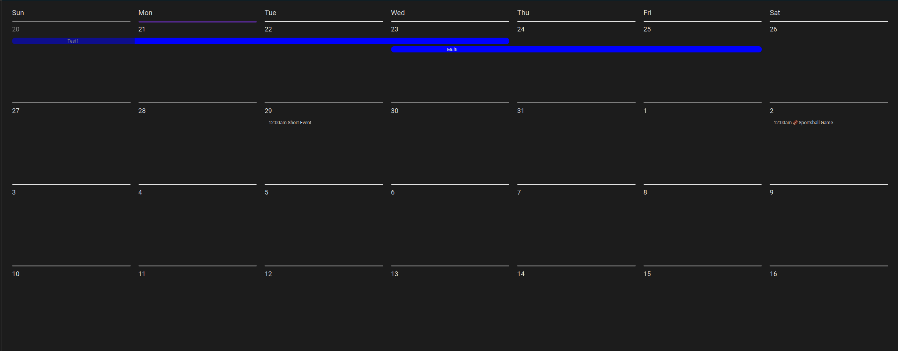
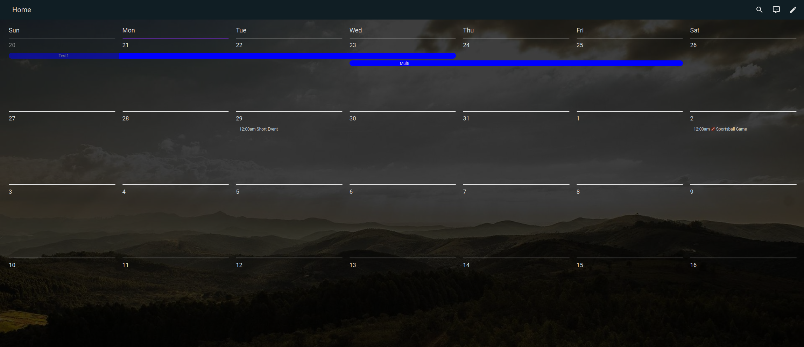

# Weekly Calendar Card
[![hacs][hacs-badge]][hacs-url]
[![release][release-badge]][release-url]
![downloads][downloads-badge]
![build][build-badge]



## Overview
This calendar grew out of my desire to have calendar displayed on my wall that was pretty.

This calendar will show a number of weeks, starting on the current week.

## Configuration Options

| Name                | Type      | Default    | Description                                                                         |
| :------------------ | :-------- | :--------- | :---------------------------------------------------------------------------------- |
| `calendars`         | calendar  | Required   | A list of calendar entities and configuration                                       |
| `local`             | string    | Optional   | The time Local, `US/Central` for example                                            |
| `title`             | string    | Optional   | Title to show above the card                                                        |
| `filter`            | string    | Optional   | Regex filter to hide events                                                         |
| `startOfWeek`       | string    | `sunday`   | Day that starts the week, lowercase                                                 |
| `weeks`             | int       | `4`        | How many weeks to show                                                              |
| `dayFormat`         | string    | `d`        | Format for the date to be rendered                                                  |
| `timeFormat`        | string    | `HH:mm`    | Format for the time to be rendered                                                  |
| `longWeekdays`      | bool      | false      | If the weekdays should be in long format (like Wednesday)                           |
| `updateInterval`    | int       | `60`       | Update Interval in Seconds                                                          |
| `hidePastEvents`    | bool      | `false`    | Hide events that have passed, instead of greying them out                           |

#### Calendar Type
| Name                | Type            | Default    | Description                                                                         |
| :------------------ | :---------------| :----------| :---------------------------------------------------------------------------------- |
| `entity`            | string          | Required   | Calendar entity                                                                     |
| `color`             | string          | Optional   | Color to show full/multi day entities                                               |
| `sorting`           | int             | 100        | The sorting of calendars, if they start at the same time                            |
| `prefix`            | string or map   | Optional   | Prefix for the event summary, if a map will try to match with default options       |
| `filter`            | string          | Optional   | Regex filter to hide events                                                         |

## Example
```yaml
type: custom:weekly-calendar-card
local: US/Central
startOfWeek: sunday
weeks: 4
title: Upcoming
dayFormat: d
timeFormat: h:mma
longWeekdays: false
filter: "Doctor"
updateInterval: 60
hidePastEvents: false
calendars:
  - entity: calendar.test
    color: red
    prefix: <3
  - entity: calendar.sports
    color: blue
    filter: baseball
    prefix:
      Football: ⚽
      Sportsball: 🏈
      default: '?'
```

## Better styling
I use this custom theme to make it look really nice on the wall.
```yaml
    transparent-cards:
        ha-card-background: transparent
        ha-card-border-color: transparent
        ha-card-box-shadow: none
        lovelace-background: 0% / 100% 100% linear-gradient(rgba(0, 0, 0, 0.75), rgba(0, 0, 0, 0.75)) no-repeat, 0% / 100% 100% url('https://picsum.photos/1920/1080') no-repeat
```



